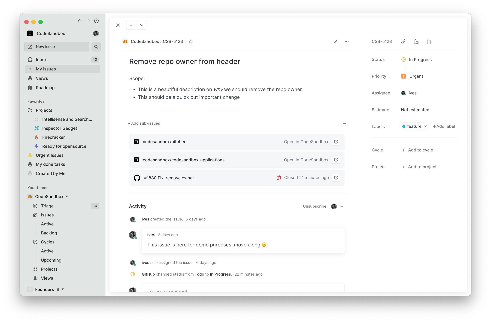
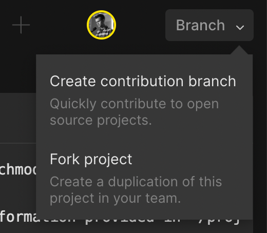

# Linear 🤝 CodeSandbox Integration

This webhook integration will allow you to open a CodeSandbox directly from a Linear issue.

You can fork this template to set this up for yourself

## How to set this up

1. Fork this repository so you get your own server

2. (Optional) import your repository in CodeSandbox at [codesandbox.io/p/dashboard](https://codesandbox.io/p/dashboard)
3. Change the configuration ([/src/config.ts](./src/config.ts)) to include your repositories
4. Generate an API token in Linear
    1. In Linear, go to Workspace Settings
    2. Go to API
    3. Create a personal API key
5. Add the API token to the environment variables
    1. Open the command palette (CMD/Ctrl + Shift + P) and search for "Add environment variables".
    2. Add the env var under the name `LINEAR_KEY`
6. Add the Webhook to Linear
    1. Go to the main branch of this repo
    2. Copy the URL [http://localhost:3000/linear-webhook](http://localhost:3000/linear-webhook) <- this URL corresponds to this branch.
    2. In Linear, go to Workspace Settings, and add it to the Webhooks under API
7. Now you will have CodeSandbox links in Linear!
